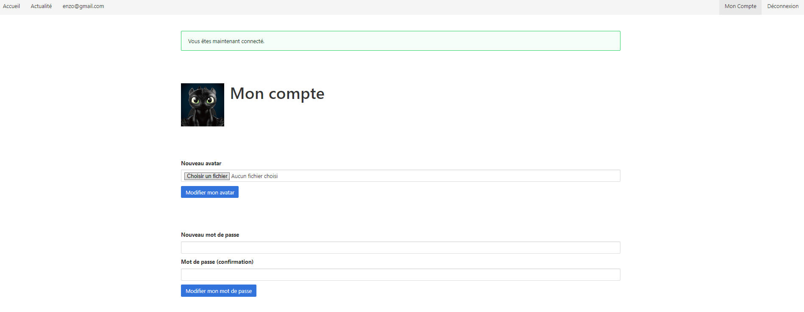

# Jour 1


Découverte de mon maitre de stage, explication de<span style="color:#0FCEFC"> **l'entreprise** </span>, les différents termes à savoir, et savoir ce que j'allais faire pendant le stage.

**Installation** </span> de php, composer et un nouveau langage qui se nomme<span style="color:#0FCEFC"> **_laravel_** </span>.

Installation d'extension pour php, pour avoir une base<span style="color:#0FCEFC"> **propre** </span> et<span style="color:#0FCEFC"> **fonctionnel** </span>. Et de la documentation sur _Laravel_.

J'ai réussi à<span style="color:#0FCEFC"> **lier** </span> une base de donnée _SQlite3_ à mon _laravel_, j'ai réussi à<span style="color:#0FCEFC"> **insérer** </span> des données comme des utilisateurs avec un email et un mot de passe. 

J'ai fait une<span style="color:#0FCEFC"> **vérification** </span> des entrés dans le formulaire pour qu'il n'y est pas n'importe quoi dans la base. J'ai utilisé des routes et un nouveau type de fichier qui se nomme<span style="color:#0FCEFC"> **_blade.php_** </span>, qui permet d'utiliser des fonctionnalités spécifiques à _Blade_. Ce sont des<span style="color:#0FCEFC"> **views** </span>.


# Jour 2 (télétravail)


Méthode<span style="color:#0FCEFC"> **MVC** </span> pour le rangement des fichiers : 

* Models, les<span style="color:#0FCEFC"> **modèles**
    
    * Les modèles sont les fichiers et les fonctions permettant d'**intéragir** </span> avec notre base de données. Dans notre application _Laravel_, cela correspond à notre fichier _app/Utilisateur.php_.

* Views, les<span style="color:#0FCEFC"> **vues**

    * Les vues permettent de<span style="color:#0FCEFC"> **gérer** </span> l'affichage de notre application. Ce sont nos fichiers _.blade.php_ dans notre dossier _ressources/views_.

* Controllers, les<span style="color:#0FCEFC"> **contrôleurs**

    * Les contrôleurs sont le reste de notre application PHP, ils vont se charger de<span style="color:#0FCEFC"> **faire le lien** </span> entre nos<span style="color:#0FCEFC"> **modèles** </span> et nos<span style="color:#0FCEFC"> **vues** </span>. Pour le moment, les contrôleurs sont représentés par notre fonctions anonymes dans le fichier _routes/web.php_.


Redirection vers une autre page : ```return redirect('/mon-compte'); ```

J'ai reussi à faire la<span style="color:#0FCEFC"> **connexion** </span> d'un user et que seule les connectés peuvent acceder à la page _mon compte_ sinon ça leur retourne la _page de connexion_.

Mise en place d'un système qui fait en sorte qu'on puisse<span style="color:#0FCEFC"> **changer** </span> de _mot de passe_ lorsqu'on est connecté et qui l'envoie dans la<span style="color:#0FCEFC"> **database** </span>.
Avec des sortes de<span style="color:#0FCEFC"> **popup** </span> (_flash_) qui disent "_si on s'est bien connecté_" ou "_si on a pas accès à la page_".

Sécurité des formulaires avec _laravel_ : ```{{ csrf_field() }}```

Petit<span style="color:#FF3535"> **problème** </span> rencontrer au niveau de l'affichage des adressses mail qui ne voulait pas ce faire mais j'ai séparé le fichier en 2 et ça a<span style="color:#B2FF35"> **fonctionné** </span>.

Ajout d'une table _message_ qui permet à un user de mettre un message seulement si il  est _connecté_.

Le<span style="color:#0FCEFC"> **middleware** </span> permet de faire en sorte qu'il faut la<span style="color:#0FCEFC"> **connexion obligatoire** </span> sur une route ou plusieurs, ici j'ai créé un groupe pour pouvoir tous leurs mettres rapidement le meme _middleware_.
Cela permet donc de ne pas remettre le même code dans tout les _controllers_ que l'on veut<span style="color:#0FCEFC"> **bloquer** </span>.

Veut dire la même chose : ```OrderByDesc() = latest()```

```firstOrFail``` permet de dire que tu prends le premier sinon tu failed en 404.

```hasMany(Message::class)``` permet de renvoyer plusieurs messages.


## Exemple de route

```Route::get('/',function(){ return view('welcome');});```

Devient :
```Route::view('/', 'welcome');```


# Jour 3 (télétravail)


```navbar-item {{$request->is('connexion')? 'is-active' : '' }}``` permet de mettre en surbrillance en fonction de si on est sur la page ou non. 

Laravel sépare ses fichiers des dossiers avec des points : 
```@include('partials.navbar-item')```

```@if (auth()->check())``` laravel à fait en une fonction simplifier : ```@auth```

J'ai une<span style="color:#0FCEFC"> **_navbar_** </span> entierement fonctionnel qui change si je suis _connecté_ ou pas et j'ai bien compris les étapes à suivre pour la faire.

J'ai utilisé une<span style="color:#0FCEFC"> **_vue partiels_** </span> pour ne pas copier coller plusieurs fois la  même chose

Pour changer le<span style="color:#0FCEFC"> **nom de la table** </span> par exemple dans la table _Utilisateur_ : 
```protected $table = 'nom_de_table'```

Relation<span style="color:#0FCEFC"> **many to many** </span> exemple : c'est un Utilisateur qui suit un autre utilisateur, il faut lui spécifier les<span style="color:#0FCEFC"> **tables** </span> et<span style="color:#0FCEFC"> **colonnes** </span> qu'il va devoir utilisé sinon il va faire n'importe quoi :

```return $this->belongsToMany(Utilisateur::class, 'suivis', 'suiveur_id', 'suivi_id');```

```php artisan make:migration create_suivis_table``` :<span style="color:#0FCEFC"> **création** </span> de la table _suivis_ avec la<span style="color:#0FCEFC"> **migrations** </span>.

Pour accéder à une<span style="color:#0FCEFC"> **relation** </span> en _laravel_ par exemple on a la fonction _message()_ pour récupérer le<span style="color:#0FCEFC"> **QueryBuilder** </span> ce qui permet de faire des requêtes SQL en _laravel_ comme la méthode  ```->create()```

Et on peut aussi utlisé un attribut _message_ pour récuperer les *éléments*, les *objets*, les *messages* associés à un _utilisateur_.

Pour faire en sorte que si la liste est<span style="color:#0FCEFC"> **vide** </span> et que l'on retourne un message en conséquence, au lieu de faire un if etc on peut feaire un ```forelse``` ce qui permet de faire moins de ligne de code et dedans on met ```@empty``` pour dire que si la _liste_ est<span style="color:#0FCEFC"> **vide** </span> on retourne ce<span style="color:#0FCEFC"> **_message_** </span>.

Nouvelle notation ```@csrf``` pour les formulaires

```{{method_field('delete')}}``` devient ```@method('delete')```

Le<span style="color:#0FCEFC"> **_markdown_** </span> très utiles pour les textes dans les mails par exemple ou pour les<span style="color:#0FCEFC"> **READ.me** </span>.

Utilisation<span style="color:#0FCEFC"> **d'envoie de mail** </span> vers un autre site qui recois les mails avec<span style="color:#0FCEFC"> **_smtp_** </span>.

``Flatten`` permet de lier plusieurs tableaux ensemble pour n'en faire qu'un.`

```sortByDesc``` permet de ranger par ordre descroissant.

Le ```flatmap``` permret de faire un<span style="color:#0FCEFC"> **flatten** </span> directement sur le<span style="color:#0FCEFC"> **map** </span>.
MERCI LARAVEL !

Pour faire une colonne en plus dans la table utilisateur : ```php artisan make:migration ajouter_colonne_avartar_aux_utilisateurs```




# Jour 4


Restructuration entière du fichier de<span style="color:#0FCEFC"> **bdd** </span> que l'on m'a donné, étant donné qu'elle etait trop<span style="color:#0FCEFC"> **lourde** </span> (**1Go** </span> alors qu'ils l'ont allégé), création  d'une fonction _python_ pour m'aider à recopier la<span style="color:#0FCEFC"> **création des tables** </span> et leurs<span style="color:#0FCEFC"> **insertions** </span> mais j'ai fait en sorte de mettre que<span style="color:#0FCEFC"> **5 insertions par table** </span> pour ne pas que ce soit trop lourd.
Je dois faire la base lié avec laravel grâce à _MariaDB_ alors que j'ai utilisé _sqlite_ pour le tp, on verra ce que ça donne mais j'ai deja tout dans _phpmyadmin_ avec l'utilsateur root.

Pour envoyer un formulaire il faut le<span style="color:#0FCEFC"> **crsf** </span> mais ce que je ne savais c'est faut changer dans le _** </span>.env**_ le ```SESSION_DRIVER=file``` qui à la base est sur _database_ et je l'ai aussi changé dans _config/session.php_.

J'ai<span style="color:#B2FF35"> **réussi** </span> à lié la _database_ _phpmyadmin_ à mon projet _laravel_ et faire<span style="color:#0FCEFC"> **afficher** </span> tout les<span style="color:#0FCEFC"> **utilisateurs** </span> depuis la _db_, j'ai aussi<span style="color:#0FCEFC"> **reussi** </span> à faire un<span style="color:#0FCEFC"> **nouveau compte** </span> mais le _prenom_ ne se met pas et le _mot de passe_ non plus.


# Jour 5


J'ai<span style="color:#B2FF35"> **réussi** </span> à mettre le _prénom_ et le _mot de passe_ c'était juste des<span style="color:#0FCEFC"> **_variables_** </span> que j'avais mal nommé, rien de grave.

Maintenant j'essaye la<span style="color:#0FCEFC"> **connexion** </span>.

La _connexion_ est<span style="color:#B2FF35"> **réussi** </span>, j'ai aussi fait les<span style="color:#0FCEFC"> **messages d'erreurs** </span> par exemple lorsqu'un _utilisateur_ à déjà un compte avec une _adresse mail_, aussi quand le _mot de passe_ ou l'utilisateur n'est pas bon lorsque je veux me _connecter_.

J'ai<span style="color:#0FCEFC"> **ajouté** </span> un bouton de<span style="color:#0FCEFC"> **suppression de compte** </span> pour voir si j'arrivai à faire de la<span style="color:#0FCEFC"> **suprression** </span> sur _laravel_ avec les différentes fonctions, et il faut savoir aussi qu'il n'y a pas de méthode _delete_ dans les<span style="color:#0FCEFC"> **formulaires** </span> donc il faut bien utiliser ```@method('delete')``` dans le formulaire pour dire à laravel que c'est bien de la<span style="color:#0FCEFC"> **suppression**

Pour faire en sorte de<span style="color:#0FCEFC"> **supprimer** </span> une valeur avec une case _input_ d'un<span style="color:#0FCEFC"> **formulaire** </span> j'ai utilisé ces ligne : 

* ```$domaine = Domains::where('name', $request->input('name'))->first()```
* ```$domaine->delete();```

Pour faire une page avec la<span style="color:#0FCEFC"> **table** </span> _keywords_ pour afficher les<span style="color:#0FCEFC"> **keywords** </span> des sites depuis notre _database_ :

* ```php artisan make:controller KeywordController```
* ```php artisan make:model Keywords```

Le<span style="color:#0FCEFC"> **make controller** </span> sert à faire en sorte de récupérer les valeurs que l'on veut dans la table, le<span style="color:#0FCEFC"> **controller** </span> est lié au<span style="color:#0FCEFC"> **models** </span>.

Le<span style="color:#0FCEFC"> **model** </span> sert à dire ce qu'il a dans la<span style="color:#0FCEFC"> **table** </span> et ce qu'on veut absolument prendre dedans.

Ensuite il ne faut pas oublié de refaire le ```php artisan serve```

Une fois ceci fait nous avons 2 fichiers qui sont crées dans _2 répertoires différents_

* ```App\Http\Controllers\KeywordController```
* ``App\Models\Keywords``

Dans le<span style="color:#0FCEFC"> **controller** </span>, je dois mettre l'appel à la base et le renvoyer vers ma<span style="color:#0FCEFC"> **vue** </span> qui se nomme ```keywords.blade.php```.
Dans le<span style="color:#0FCEFC"> **model** </span>, je dois mettre les champs dont j'ai besoin dans ma<span style="color:#0FCEFC"> **vue** </span> et mon<span style="color:#0FCEFC"> **controller** </span>.

Une fois ceci fait, je dois faire ma<span style="color:#0FCEFC"> **vue** </span> avec un<span style="color:#0FCEFC"> **tableau** </span> qui affiche mes différentes valeurs avec la _table_.

Ne pas oublié d'appeler le<span style="color:#0FCEFC"> **layout** </span> pour charger le framework _bulma_ et les messages _flash()_, il faut faire très attention au nom des __variables__ parce qu'elles sont très<span style="color:#0FCEFC"> **sensibles** </span> et il y en a beaucoup.


# Jour 6


La table __tasks__ était vide dû à un probleme de clé<span style="color:#0FCEFC"> **étrangère** </span> par rapport au autres tables qui était mal<span style="color:#0FCEFC"> **inséré** </span>. Donc j'ai dû faire en sorte de<span style="color:#0FCEFC"> **remplir les autres tables** </span> mais les données d'insertion avait des problemes donc j'ai dû les réglés. Mais au final j'ai<span style="color:#0FCEFC"> **réussi** </span> à inseré mes données dans la table _tasks_ donc je vais pouvoir continuer.

Je dois faire une page qui répertori le<span style="color:#0FCEFC"> **nom** </span>,<span style="color:#0FCEFC"> **prénom** </span> et d'autres choses sur la table _users_, et je dois la relier à la table _tasks_ pour compter le nombre de task qu'une<span style="color:#0FCEFC"> **personne** </span> à faite.

Pour faire une jointure entre 2 tables :
```
$tasks = DB::table('tasks')
            ->join('users', 'tasks.user_id', '=', 'users.id')
            ->select('tasks.*', 'users.first_name', 'users.last_name')
            ->get();

        return view('tasks', ['tasks' => $tasks]);
```

J'ai donc fait une page __Tâches__ qui permet de répertorié toute les taches faites et j'ai affiché les _noms_ et _prénom_ grâce à la<span style="color:#0FCEFC"> **jointure** </span> et au _user_id_.

Ensuite j'ai fait en sorte qu'on puisse changé le _nom_ et _prenom_ des _utilisateurs_ uniquement si on est<span style="color:#0FCEFC"> **connecté** </span>, parce que sinon les noms était __First_name__ et __Last_name__ donc pas très parlant.

De plus j'ai ajouté un tableau qui compte le nombre de tache par _user_ et qui met un lien qui affiche une nouvelle page, celle des détails d'un utilisateur, donc si on clique sur damien klein cela affiche le détails des tâches de<span style="color:#0FCEFC"> **Damien** </span>.

J'ai aussi inséré plus de donnée dans la table __tasks__ et les autres tables pour que la Database soit un peu plus<span style="color:#0FCEFC"> **volumineuse** </span>.

Le ```->get()``` sur une requete peremet de directement<span style="color:#0FCEFC"> **exécuter** </span> la requete, ils sont stockés dans une collection de __modeles__

J'ai fait un filtre sur la colonne _published_at_ pour<span style="color:#0FCEFC"> **trier** </span> par ordre<span style="color:#0FCEFC"> **croissant** </span>.

### Demain je dois faire : 

* chercher un utilisateur en fonction d'un id ou d'un nom 

* une recherche avec une sélection à l'aide d'un volet déroulant (par exemple avec les grades silvers etc).

* Et je passerais à l'admin donc je vais déjà voir comment ils l'ont conçu comment je vais pouvoir y implémenter des trucs dedans, je ne fais que de l'affichage et pas de l'insertion donc ça ne devrait pas être trop compliquer. Mon but est de rendre l'admin beaucoup plus lisible et plus fonctionnel et rapide.


# Jour 7 (télétravail)


J'ai fait une fonction de recherche de<span style="color:#0FCEFC"> **nom d'utilisateur** </span> dans la page où il y a tout les _utilisateurs_.

J'ai fait un<span style="color:#0FCEFC"> **volet déroulant** </span> qui permet de classé les _tâches_ par type par exemple

```
extension=intl
extension=zip 
```

J'ai refait la configuration entière de<span style="color:#0FCEFC"> **php** </span> car ma version ne correspondait pas j'avais la version _8.3.6_ et il fallait une version en desssous de _8.3_.
Il y a une extension qui n'est pas disponible sur windows c'est __pcntl__, j'ai donc dû faire cette commande composer : ```composer require laravel/horizon --ignore-platform-reqs``` et ensuite mon ```composer install``` a fonctionné mais j'ai toujours des *warnings* php.

Une fois ceci fait j'ai tenté de connecter ma database mais je n'ai<span style="color:#FF3535"> **pas réussi** </span> tout seul, j'ai dû demandé à<span style="color:#0FCEFC"> **damien** </span> qui m'a quand même laisser cogiter un peu et finalement je cherchais bien dans le bon fichier le ``.env`` j'avais juste pas mis<span style="color:#0FCEFC"> **2 variables** </span> qui était apparement<span style="color:#B2FF35"> **essentiel** </span>.

Maintenant que la database est<span style="color:#0FCEFC"> **connecté** </span>, je peux me connecter avec mon user grâce à mon _adresse email_.

Je suis allé sur __phpmyadmin__ pour aller dans la table _user_, et changer le booléen _is_admin_ à 1 pour que je sois<span style="color:#0FCEFC"> **admin** </span>.

Maintenant j'ai accès à tout ce que les admins ont mais en<span style="color:#0FCEFC"> **local** </span> et avec<span style="color:#0FCEFC"> **ma propre base de donnée** </span>, pour ne pas faire de _bétise_.


# Jour 8 (télétravail)


Aujourd'hui je vais<span style="color:#0FCEFC"> **analyser** </span> tout le code pour voir quel sont leurs techniques de<span style="color:#0FCEFC"> **codage** </span> , et surtout quels sont les fichiers<span style="color:#0FCEFC"> **admin** </span> pour que je puisses les<span style="color:#0FCEFC"> **modifiers** </span> ou en<span style="color:#0FCEFC"> **ajouter** </span>.

### <span style="color:#8979FF"> _App\Http\Controllers\Admin_ </span> :

#### Dans AdminDashboardController :

* function ```__construct()``` -> qui permet de faire appel au<span style="color:#0FCEFC"> **middleware** </span> pour dire qu'il est<span style="color:#0FCEFC"> **admin**
* function ```show()```
	* la variable __dashboard__ permet de venir chercher toute les informations qui sont contenu dans les tables avec des ``where()``, des ``whereDay()``, des ``count()``, des ``whereYear()``, des ``whereMonth()``, des ``whereNull()``, des ``sum()``.

Il return une vue qui se nome<span style="color:#0FCEFC"> **admin.dashboard** </span> où il compact _dashboard_ : ``return view('admin.dashboard', compact('dashboard')); ``

#### Dans AdminErrorReasonsController :

* Il ya une fonction ``index()`` 
	* retourne une réponse<span style="color:#0FCEFC"> **error** </span> dans le<span style="color:#0FCEFC"> ***json*** </span> qu'il renvoie à l'admin

#### Dans AdminOrderController :

* l'index se trouve dans _admin.order.index_
* on a 
	* un<span style="color:#0FCEFC"> **compatage** </span> du<span style="color:#0FCEFC"> **nombre de tache**
	* un systeme de<span style="color:#0FCEFC"> **nouvelle deadline**

* une _fonction_ qui permet de mettre une<span style="color:#0FCEFC"> **tache prioritaire**

#### Dans AdminSupportAnswersController :

* fonction ``index ()`` : retourne une<span style="color:#0FCEFC"> **liste d'item** </span> (réponse) qu'il vient récupérer avec ``::get()``


#### Dans AdminSupportController :

* ``index()`` renvoie vers __admin.support__
* un systeme de <span style="color:#0FCEFC"> **supporTicket** </span>

* une fonction qui<span style="color:#0FCEFC"> **supp un ticket**
* une fonction qui<span style="color:#0FCEFC"> **créer** </span> un<span style="color:#0FCEFC"> **ticket** </span> pour un<span style="color:#0FCEFC"> **partner**

#### Dans AdminTaskController :

* fonction qui dit si c'est<span style="color:#0FCEFC"> **pas conforme** </span>
* fonction<span style="color:#FA885B"> **mailPartner** </span>
* fonction pour créer un<span style="color:#0FCEFC"> **textbulker** </span>avec un mot clé
* fonction de<span style="color:#0FCEFC"> **reset** </span>et de<span style="color:#0FCEFC"> **update**
* fonctions d'**assignation** </span>comme spot, writter
* fonction<span style="color:#FA885B"> **publish**
* fonction qui<span style="color:#FA885B"> **check_duplicate**


#### Dans AdminUserController : 

* fonction ```show(user)``` : qui met _visible_ ses<span style="color:#0FCEFC"> **commentaires** </span>et qui les renvoies dans la vue __admin.user__
* fonction qui permet de d'**enlever un publieur**
* fonction<span style="color:#FA885B"> **update** </span>qui update toute les<span style="color:#0FCEFC"> **infos de l'utilisateur**
* fonction qui<span style="color:#0FCEFC"> **ajoute** </span>un<span style="color:#0FCEFC"> **credit** </span>, avec des<span style="color:#0FCEFC"> **factures** </span>etc. 
* fonction qui<span style="color:#0FCEFC"> **enleve un credit**
* fonction de<span style="color:#0FCEFC"> **report de client**
* fonction pour<span style="color:#0FCEFC"> **restaurer un user**
* fonction qui<span style="color:#0FCEFC"> **export un wallet**

#### Dans AdminWebsiteController : 

* fonction qui montre les<span style="color:#0FCEFC"> **sites** </span>avec leur<span style="color:#0FCEFC"> **thématique** </span>et qui les renvois dans __admin.website.show__
* fonction de<span style="color:#0FCEFC"> **doublon** </span>qui renvoie la vue __admin.website.doublon__.

#### Dans AdminWidgetController :

* fonction<span style="color:#FA885B"> **revenus** </span>qui utilise la table<span style="color:#0FCEFC"> **orders**
* fonction d'un nouvelle utilisateur qui utilise la table<span style="color:#0FCEFC"> **users**
* fonction de tickets qui utilise la table<span style="color:#0FCEFC"> **support_tickets**
* fonction<span style="color:#FA885B"> **tasks** </span>qui utilise la table<span style="color:#0FCEFC"> **tasks**
* fonction qui permet de mettre un format pour les<span style="color:#0FCEFC"> **graphes**
* fonction de<span style="color:#0FCEFC"> **reports** </span>qui retourne la vue __admin.reports__

#### Dans AdminWriterController :

* fonction<span style="color:#0FCEFC"> **monthly** </span>qui<span style="color:#0FCEFC"> **compte le nombre de mois** </span>et la<span style="color:#0FCEFC"> **derniere tache** </span>faite par un<span style="color:#0FCEFC"> **writter** </span>et sa<span style="color:#0FCEFC"> **notation**


###  <span style="color:#8979FF"> App\Http\AdminController : </span> 


* fonction<span style="color:#FA885B"> **writters** </span>qui permet de select l'**id** </span>et le<span style="color:#0FCEFC"> **mail** </span>ordonné par email seulement pour les<span style="color:#0FCEFC"> **writers**
* fonction<span style="color:#FA885B"> **webstites** </span>qui permet de faire des<span style="color:#0FCEFC"> **filtres**
* fonction<span style="color:#FA885B"> **websites_doublons** </span>qui permet de récupérer la table<span style="color:#0FCEFC"> **websites** </span>et de voir les<span style="color:#0FCEFC"> **doublons**
* fonction<span style="color:#FA885B"> **details** </span>des<span style="color:#0FCEFC"> **doublons**
* fonction<span style="color:#FA885B"> **sources** </span>qui fait des<span style="color:#0FCEFC"> **filtres** </span>aussi
* fonction pour avoir<span style="color:#0FCEFC"> **les prix des websites**
* fonction qui<span style="color:#0FCEFC"> **qualifie la source**
* fonction qui<span style="color:#0FCEFC"> **télécharge** </span>le<span style="color:#0FCEFC"> **paiement** </span>des<span style="color:#0FCEFC"> **factures**

 
###  <span style="color:#8979FF"> App\Http\AdminV3UrssafsDownload : </span> 

* fonction qui permet de<span style="color:#0FCEFC"> **télécharger** </span>un fichier<span style="color:#0FCEFC"> **urssaf**

###  <span style="color:#8979FF"> App\Http\Midleware\UserIsAdmin : </span> 

* fonction<span style="color:#FA885B"> **hundle** </span>qui permet de dire que si on est<span style="color:#0FCEFC"> **pas connecté** </span>on ne peut pas y aller


###  <span style="color:#8979FF"> App\Http\Notifications\AdminAlertNotification :  </span> 

permet d'obtenir les<span style="color:#0FCEFC"> **canaux des notifications**


###  <span style="color:#8979FF"> ressources\views\admin\ : </span> 

Tout ce qui est dans ce fichier concerne la<span style="color:#0FCEFC"> **v1**


###  <span style="color:#8979FF"> App\Http\Livewire\admin\dashboard.php : </span> 

* 2 tableaux array
	* ``$filters`` avec _date_start_ et _date_end_
	* ``$periodicalStats`` avec le <span style="color:#0FCEFC"> **ca** </span>, <span style="color:#0FCEFC"> **users** </span>, <span style="color:#0FCEFC"> **createdTasks** </span>, <span style="color:#0FCEFC"> **endedTasks** </span>et <span style="color:#0FCEFC"> **publishedTasks**

* fonction <span style="color:#0FCEFC"> **mount** </span>
	* des <span style="color:#0FCEFC"> **filters**
	* plusieurs <span style="color:#0FCEFC"> **get** </span>et <span style="color:#0FCEFC"> **load** </span>(_userStats_ ...)
	

* fonction <span style="color:#FA885B"> **getUsersStats** </span>, <span style="color:#FA885B"> **getNewCustomersStats** </span>, <span style="color:#FA885B"> **getRevenueStats**
	* ça prends les <span style="color:#0FCEFC"> **user** </span>en fonction de leur <span style="color:#0FCEFC"> **date de création**

* fonction <span style="color:#FA885B"> **startDate** </span>qui permet de prendre prendre le <span style="color:#0FCEFC"> **premier jour du mois**

* fonction <span style="color:#FA885B"> **loadCaMensuel** </span>permet de charger le** </span>chiffre d'affaire** </span>avec la <span style="color:#0FCEFC"> **date** </span>et la <span style="color:#0FCEFC"> **sum** </span>de <span style="color:#0FCEFC"> **total_ht**

* fonction <span style="color:#FA885B"> **createdChartCA** </span>fait une requete sur la table __orders__ et prend la <span style="color:#0FCEFC"> **sum** </span>et la <span style="color:#0FCEFC"> **date de création**

* fonction <span style="color:#FA885B"> **createChartNewUsers** </span>fait la meme chose sur la table __users__

* fonction *createChartTasks* fait la meme chose sur la table __tasks__

* fonction <span style="color:#FA885B"> **fetchPeriodicalStats** </span>permet de faire des requête sur les tables que j'ai cité avant avec une <span style="color:#0FCEFC"> **date de début** </span>et une <span style="color:#0FCEFC"> **date de fin** </span>avec la <span style="color:#0FCEFC"> **created_at** </span>et <span style="color:#0FCEFC"> **published_at** </span>et <span style="color:#0FCEFC"> **writer_done_at**

* fonction <span style="color:#FA885B"> **getRefererencesDates** </span>permet de voir <span style="color:#0FCEFC"> **les dates sur une période**

* fonction <span style="color:#FA885B"> **render** </span>qui retourne une vue __livewire.admin.dashboard__


Tout les dossiers qu'il y a des <span style="color:#0FCEFC"> **admin** </span>:

Contact, Content, Contentorder, Customer, Encours, Netlinking, Network, Order, Partials, Payments, Presse, Publish, Quotation, Tasks, Veille, Website, Widgets

###  <span style="color:#8979FF"> resources\views\livewire\admin\dashboard.blade.php </span> 

Dans ce fichier nous avons la vue pour faire la création de notre <span style="color:#0FCEFC"> **dashbord**

###  <span style="color:#8979FF"> resources\views\components\admin-menu.blade.php </span> 

Le <span style="color:#0FCEFC"> **menu** </span>des <span style="color:#0FCEFC"> **admins** </span>, je vais devoir le changer pour pouvoir y intégrer <span style="color:#0FCEFC"> **une de mes pages**.

La fonction <span style="color:#0FCEFC"> **render** </span>renvoie <span style="color:#0FCEFC"> **toujours une vue** </span>et aussi elle met en flèche le <span style="color:#0FCEFC"> **layout** </span>qu'elle doit charger pour avoir par exemple le <span style="color:#0FCEFC"> **titre** </span>de la page et ils utilisent aussi ces 2 choses: 
* ``'livewire' => true``
* ``'useAlpine' => true``

J'ai trouvé une page <span style="color:#0FCEFC"> **secrete** </span>seulement pour les <span style="color:#0FCEFC"> **développers** </span>qui permet de modifier certaines choses comme le <span style="color:#0FCEFC"> **site d'une commande** </span>ou le <span style="color:#0FCEFC"> **rédacteur tâches**. 

Pour mettre du <span style="color:#0FCEFC"> **css** </span>dans les <span style="color:#0FCEFC"> **vues** </span>il faut utiliser la méthode ``@push('css')``


### Un <span style="color:#0FCEFC">**textBulker** </span> permet de faire un texte <span style="color:#0FCEFC">**optimisé** </span>grâce à un mot clé.


# Jour 9

Je dois mettre tout les <span style="color:#0FCEFC">**fichiers** </span> au quels j'ai touché dans le <span style="color:#0FCEFC">**projet** </span> pour que si y'a quelque chose qui ne va pas, on puisse voir où c'est plus tard.

Déja j'ai <span style="color:#0FCEFC">**modifié** </span> le fichier  <span style="color:#8979FF">__admin-menu.blade__ </span>, pour y mettre mon <span style="color:#0FCEFC">**id** </span> sur le if, pour pouvoir avoir le menu secret des devs. ```||$auth_user->id === 14432```

Pour faire une <span style="color:#0FCEFC">**nouvelle page** </span> dans le <span style="color:#0FCEFC">**menu** </span> :

###  <span style="color:#8979FF">__admin-menu.blade.php__ </span> 
```
<li>
    <a class="{{ request()->routeIs('admin.v3.enzo*') ? 'active' : '' }}"
        href="{{ route('admin.v3.enzo') }}">
		<i class="w-6 pr-2 fad fa-enzo"></i>
		Enzo
	</a>
</li>
```

###  <span style="color:#8979FF"> routes\livewire.php</span> 

```
Route::get('/enzo', \App\Http\Livewire\Admin\Enzo\Enzo::class)
->name('admin.v3.enzo');
```

### <span style="color:#8979FF"> App\Http\livewire\admin\enzo.php </span> 

```
use WithPagination;
public function render()
    {
        return view(
            'livewire.admin.enzo',
        )->layout(
            'components.layout.admin',
            [
                'useLivewire' => true,
                'title' => 'Enzo',
            ]
        );
    }
```
 
### <span style="color:#8979FF"> ressources\view\\livewire\admin\enzo.blade.php </span>
```
<h1> Coucou </h1>
```
Ce bloc je l'ai changé par la suite pour mettre les différentes choses


Pour que la route puisse trouver le <span style="color:#0FCEFC">**controller** </span> dans <span style="color:#0FCEFC">**livewire** </span> il faut utiliser le 
```use WithPagination;``` sinon elle ne retrouve pas la page

J'ai ajouté le fichier  <span style="color:#0FCEFC">__details-tache.blade.php__

Lorsque je veux faire appel à un <span style="color:#0FCEFC">**prénom** </span> et à un <span style="color:#0FCEFC">**nom** </span> dans la table _tasks_ je dois faire dans le foreach ``$task->user->first_name``.

<span style="color:#0FCEFC"> **useAlpine** </span>c'est un composant qui permet d'utiliser du __Javascript__ sans faire de JS, il est utilisé avec _laravel_ et _livewire_.

J'ai fait une<span style="color:#0FCEFC"> **pagination** </span>pour faire en sorte que le<span style="color:#0FCEFC"> **tableau** </span>soit moins grands mais je<span style="color:#0FCEFC"> **n'arrives pas** </span>à la faire sur la table _users_.


# Jour 10


Les fichiers que **j'ai changé** pour l'instant :

* <span style="color:#8979FF"> **App\Htpp\Livewire\Admin\Enzo** </span> : j'ai rajouté un dossier avec mon prénom pour savoir que c'est le miens je le changerai par la suite

* <span style="color:#8979FF"> **resources\views\livewire\admin\details-tache.blade.php** </span> : la vue pour avoir le détail des taches.

* <span style="color:#8979FF"> **resources\views\livewire\admin\enzo.blade.php** </span> : la vue pour mettre les principaux tableaux.

* <span style="color:#8979FF"> **resouces\views\componants\admin-menu.blade.php** </span> : j'ai mis mon id pour avoir l'onglet en plus, et j'y ai mis mon onglet pour pouvoir accéder à ma page

* <span style="color:#8979FF"> **routes\livewire.php** </span> : j'y ai mis les 2 routes que j'utilise.


``fad fa-flask`` : c'est pour les <span style="color:#0FCEFC">**icons** </span> à gauche des onglets, ça fait appel à une <span style="color:#0FCEFC">**bibliothèque externres** </span> pour prendre moins de place.

Ce que je dois faire aujourd'hui :

<span style="color:#0FCEFC">**recherche** </span> avec un ID
<span style="color:#0FCEFC">**tri** </span> avec le user
<span style="color:#0FCEFC">**pagination** </span> des tableaux 
<span style="color:#0FCEFC">**select** </span> des types

J'ai fait un <span style="color:#0FCEFC">**systeme de tri** </span> par exemple on peut rentrer un <span style="color:#0FCEFC">**id** </span> pour pouvoir voir tout ce qu'à fait un <span style="color:#0FCEFC">**user** </span> au niveau des _tasks_. On peut aussi <span style="color:#0FCEFC">**séléctionner** </span> un <span style="color:#0FCEFC">**type** </span> ce qui mettra toute les taches pour un type.
J'ai aussi fait en sorte de pourvoir <span style="color:#0FCEFC">**trier les users** </span> par ordre <span style="color:#0FCEFC">**croissant** </span> ou <span style="color:#0FCEFC">**décroissant** </span> 


# Jour 11 


J'ai <span style="color:#B2FF35"> **réussi** </span> à régler mon <span style="color:#0FCEFC"> **filtre** </span> car en effet lorsque je faisais un <span style="color:#0FCEFC"> **filtre par type** </span> et que je faisais un <span style="color:#0FCEFC"> **tri** </span> par _user_id_ le filtre s'enlevait complétement. Maintenant lorsque je mets un filtre et que je fais un tri par _user_id_ tout est <span style="color:#0FCEFC"> **bon** </span>.


Je dois commencer le <span style="color:#0FCEFC"> **vrai travail** </span> qui va servir <span style="color:#0FCEFC"> **aux membres de l'équipe** </span>.
Je dois faire une page _``suivi editeurs``_ qui permet de tout savoir sur un <span style="color:#0FCEFC"> **éditeur** </span>, savoir si il a un <span style="color:#0FCEFC"> **parrain** </span>, ses <span style="color:#0FCEFC"> **informations** </span> le concernant, et plusieurs choses sur <span style="color:#0FCEFC"> **les sites où il a écrit des articles** </span>.

Je commence par <span style="color:#0FCEFC"> **modifier** </span> le ``admin-menu.blade.php`` pour y mettre un nouvel onglet qui se nomme ``Suivi éditeurs``

J'ai modifier le ``livewire.php`` pour y mettre ma <span style="color:#0FCEFC"> **route** </span> vers ma _class_.

Ensuite je créé un <span style="color:#0FCEFC"> **dosier** </span> qui se nomme <span style="color:#0FCEFC"> **_Editor_** </span> où je mets un fichier ``app\Http\Livewire\Admin\Editor\Editor.php``

Je crée un dossier ``resources\views\livewire\admin\editor\editors.blade.php`` qui est donc ma <span style="color:#0FCEFC"> **vue** </span> pour la page

J'ai modifier le ficher ``UserScopes.php`` pour y intégrer une méthode de <span style="color:#0FCEFC"> **filtrage** </span> parce qu'il n'y en avait pas.

Aujourd'hui j'ai fait la page pour les <span style="color:#0FCEFC"> **éditeurs** </span>, avec des <span style="color:#0FCEFC"> **tris** </span>, des <span style="color:#0FCEFC"> **filtres** </span> (fonctionne pas), des <span style="color:#0FCEFC"> **paginations** </span>, et il me manque les dernieres informations pour pouvoir finir la page mais j'ai déjà bien commencer


# Jour 12 (télétravail)


Je continue de faire ma page <span style="color:#0FCEFC"> **éditeurs** </span> car j'ai de <span style="color:#0FCEFC"> **nouvelles informations** </span>, je dois faire s'il il a une <span style="color:#0FCEFC"> **tache en  attente de réponse** </span>, son <span style="color:#0FCEFC"> **délai de réponse moyen** </span> et le <span style="color:#0FCEFC"> **nombre de tâches refusées** </span>.


| Départ |    Fin   | Temps |
| :------|:--------:| -----:|
| 11h00  | 12h40    |  1h40 |
| 13h00  | 14h00    |  1h00 |
| 18h00  | 20h00    |  2h00 |
| 10h30  | 13h00    |  2h30 |
| Total  |          |  7h10 |

J'ai <span style="color:#B2FF35">réussi </span> à tout faire, c'est à dire de mettre le <span style="color:#0FCEFC"> **nombre de tâches** </span> qui sont une <span style="color:#0FCEFC"> **attentes** </span> pour un editeur, son d**élai de réponse moyen en heure** </span>, et son <span style="color:#0FCEFC"> **nombre de tâches reufusées** </span> pour son <span style="color:#0FCEFC"> **nombre de tâches acceptées** </span> . Une fois que j'ai fini ça j'ai commencé à faire de l'**esthétique** </span> avec du <span style="color:#0FCEFC"> **_scss_** </span> mais c'est compliqué vu toute les classes. Lorsque je changais quelques choses dans un css rien ne bougeait donc j'ai du <span style="color:#0FCEFC"> **instsaller** </span> la bibliothèque __mix__ pour pouvoir <span style="color:#0FCEFC"> **recharger** </span> tout le css mais ça prend un peu de temps.


# Jour 13 


Je m'occupe du <span style="color:#0FCEFC"> **css** </span> du <span style="color:#0FCEFC"> **tableau** </span> pour tout ce qui est <span style="color:#0FCEFC"> **couleur** </span>, lorsqu'il n'y a pas de valeur mettre une <span style="color:#0FCEFC"> **croix rouge ❌** </span> et lorsqu'une personne <span style="color:#0FCEFC"> **à un parrain** </span> mettre un <span style="color:#0FCEFC"> **check vert ✅** </span>, tout les tris fonctionne aussi, j'en suis content, je me penche vers le <span style="color:#0FCEFC"> **filtre** </span> en fonction de l'**id** </span> ou de l'**adresse email** </span>.

J'ai <span style="color:#B2FF35"> **réussi** </span> à faire <span style="color:#0FCEFC"> **fonctionner** </span> mon <span style="color:#0FCEFC"> **filtre** </span> pour le <span style="color:#0FCEFC"> **user et pour l'email** </span>, avec le même <span style="color:#0FCEFC"> **design** </span> que dans les <span style="color:#0FCEFC"> **autres pages** </span> donc c'est parfait !

Quand j'enverai en <span style="color:#0FCEFC"> **prod** </span>, il faudra que je fasses en sorte d'afficher <span style="color:#0FCEFC"> **seulement les éditeurs** </span> et pas tout les utilisateurs, sinon il y aurai un peu trop de donnée <span style="color:#0FCEFC"> **inutiles** </span>.

J'ai fait les <span style="color:#0FCEFC"> **commentaires** </span> dans mes principaux fichiers ``Editor.php`` et ``editors.blade.php``, pour pouvoir m'y retrouver parce que ça commençais à être compliqué. Je peux mieux m'y retrouver maintenant et comme ça si quelqu'un reprends mon <span style="color:#0FCEFC"> **code** </span> il <span style="color:#0FCEFC"> **comprendra mieux** </span> ce que j'ai fait.

J'ai rajouté un <span style="color:#0FCEFC"> **popup** </span> pour pouvoir <span style="color:#0FCEFC"> **enlever des colonnes** </span> que l'on ne veut pas voir tels que __phone__, pour l'instant je l'ai fait que sur celui ci, et il faut que je le fasses sur tous pour pouvoir <span style="color:#0FCEFC"> **garder** </span> que ce qui les <span style="color:#0FCEFC"> **interessent** </span>, les <span style="color:#0FCEFC"> **checkbox** </span> ont une <span style="color:#0FCEFC"> **animation de transition** </span> pour un plus belle effet. Quand j'ouvre le <span style="color:#0FCEFC"> **popup** </span> le <span style="color:#0FCEFC"> **fond** </span> se met en <span style="color:#0FCEFC"> **flou** </span> pour un meilleur effet.


# Jour 14 


Pendant toute la journée, j'ai tenté de faire une <span style="color:#0FCEFC"> **fonction globale** </span> pour pouvoir faire sur toute les colonnes, mais je n'ai <span style="color:#FF3535"> **pas réussi** </span> donc j'ai fait une fonction par une fonction et cela fonctionne j'ai donc fait pour la colonne __email__, __phone__, __date inscription__, __parrain__ (Deux colonnes).


# Jour 15 


>24h : vert
entre 24h et 72h : orange
>72h : rouge

Aujourdhui j'ai <span style="color:#0FCEFC"> **restructuré** </span> entièrement mon css parce que c'était <span style="color:#FF3535"> **pas beau**</span>, <span style="color:#FF3535"> **pas très lisible** </span>, donc j'ai fait quelque chose de plus <span style="color:#0FCEFC"> **sobre** </span>, avec du <span style="color:#0FCEFC"> **bleu** </span>, du <span style="color:#0FCEFC"> **blanc** </span>, du <span style="color:#0FCEFC"> **gris** </span> et des couleurs pour les <span style="color:#0FCEFC"> **pastilles** </span> dans certaines <span style="color:#0FCEFC"> **catégories** </span>.

J'ai mis la <span style="color:#0FCEFC"> **dernière colonne** </span> du tableau en <span style="color:#0FCEFC"> **sticky** </span> et j'ai mis le tableau en <span style="color:#0FCEFC"> **scrollable** </span> pour que ce soit <span style="color:#0FCEFC"> **plus simple d'accès** </span>.

J'ai fait le système d'heure aussi pour le délai de réponse moyen donc si il est <span style="color:#B2FF35"> **inférieur à 24h c'est en vert** </span>, si il est <span style="color:#FFA035"> **entre 24h et 72h c'est en orange** </span> et si c'est <span style="color:#FF3535"> **supérieure à 72h c'est en rouge** </span>.

Demain j'essayerai de mettre une <span style="color:#0FCEFC"> **ombre** </span> sur le côté gauche de la dernière colonne pour ajouter de l'**esthétique** </span>.

Petite modification aussi j'ai fait les <span style="color:#0FCEFC"> **taches refusées par rapport au tâches globale** </span> et plus par rapport au tâches acceptés ce qui faisait bizarre.


# Jour 16 (télétravail)


J'ai réussi à mettre la <span style="color:#0FCEFC"> **zone d'ombre** </span> à <span style="color:#0FCEFC"> **gauche** </span> de la dernière colonne mais j'ai pas mal galéré car j'avais pas mis d'**opacité** </span> ce qui ne faisait pas apparaître l'ombre.

J'ai <span style="color:#0FCEFC"> **bougé** </span> le <span style="color:#0FCEFC"> **bouton** </span> pour ouvrir le <span style="color:#0FCEFC"> **popup** </span>, et j'y ai mis une <span style="color:#0FCEFC"> **icône de filtre** </span> à sa gauche.
Je dois essayé de faire en sorte que lorsque je vais au bout du tableau l'ombre s'enlève mais c'est du javascripts et je ne m'y connais pas vraiment la dedans.
<span style="color:#FF3535"> **Je n'ai pas réussi à le faire** </span> donc j'essayerai vendredi.


# Jour 17 (télétravail)


Aujourd'hui je vais réessayer de faire en sorte que la barre d'ombre s'enlève dès que je vais au bout du tableau mais c'est <span style="color:#0FCEFC"> **très compliqué** </span>.

J'ai fait la <span style="color:#0FCEFC"> **mise en forme du tableau** </span> qui partait dans tout les sens avec les fleches etc.

J'ai fait en sorte que quand une personne à <span style="color:#0FCEFC"> **crée** </span> son <span style="color:#0FCEFC"> **compte** </span> il y a moins d'un an il y est une vignette <span style="color:#0FCEFC"> **NEW** </span> à coté de son <span style="color:#0FCEFC"> **nom**


# Jour 18 


J'ai <span style="color:#0FCEFC"> **changé** </span> quelque petite chose sur le <span style="color:#0FCEFC"> **tableau** </span>, pour les <span style="color:#0FCEFC"> **tâches en attente de réponse** </span>, si il n'en a <span style="color:#0FCEFC"> **pas** </span> je l'ai mis en <span style="color:#0FCEFC"> **noir** </span> sinon il est en <span style="color:#FF3535"> **rouge** </span>, ensuite j'ai mis <span style="color:#0FCEFC"> **mois** </span> et <span style="color:#0FCEFC"> **année** </span> pour le <span style="color:#0FCEFC"> **nb de publication** </span> et <span style="color:#0FCEFC"> **gains** </span> et enfin pour les <span style="color:#0FCEFC"> **tâches refusées** </span> si il en a <span style="color:#0FCEFC"> **au moins une** </span> ça se met en <span style="color:#FF3535"> **rouge** </span>.

J'essaye de régler le <span style="color:#0FCEFC"> **problème** </span> du <span style="color:#0FCEFC"> **filtre** </span> pour <span style="color:#0FCEFC"> **id** </span> et <span style="color:#0FCEFC"> **email** </span> mais je n'y arrive pas.

J'ai <span style="color:#0FCEFC"> **réglé** </span> un <span style="color:#0FCEFC"> **problème** </span> de méthode <span style="color:#0FCEFC"> **GET** </span> alors qu'il fallait [POST](https://laracasts.com/discuss/channels/livewire/the-get-method-is-not-supported-for-this-route-supported-methods-post-13
) et c'était juste un ``use pagination`` qu'il fallait.

Je regarde depuis tout à l'heure le problème du filtre et j'ai compris qu'il <span style="color:#0FCEFC"> **affiche** </span> encore les <span style="color:#0FCEFC"> **résultats précédent** </span> à la suite du résultat que je lui ai demandé et <span style="color:#FF3535"> **je ne vois pas comment le réglé** </span>.

J'ai fait un système où l'on peut <span style="color:#0FCEFC"> **changer le nombre de résultat par pages** </span> c'est ce qui m'a fait comprendre le problème.


Explication du problème : 

J'ai compris mon problème en faisant le nombre de résultat par pages, enfaite lorsque passe par exemple de <span style="color:#0FCEFC"> **1 à 10** </span> de <span style="color:#0FCEFC"> **10 à 20** </span> tout va bien il rajoute les lignes. Mais lorsque je passe de <span style="color:#0FCEFC"> **20 à 10** </span> par exemple il <span style="color:#0FCEFC"> **conserve** </span> les <span style="color:#0FCEFC"> **10 dernières lignes** </span> du nombre de résultat à 20. En revanche <span style="color:#0FCEFC"> **la pagination est bonne** </span>. Donc si je change de page ça va changer les 10 premières lignes et les <span style="color:#0FCEFC"> **10 dernières lignes restent inchangé** </span> alors qu'elles ne <span style="color:#0FCEFC"> **devraient plus être là** </span>.

Le problème est donc le même lorsque je fais une recherche sur un <span style="color:#0FCEFC"> **id** </span> ou un <span style="color:#0FCEFC"> **email** </span>, il me met tout en haut en 1 er l'id de ma recherche et ensuite il met les <span style="color:#0FCEFC"> **résultats** </span> qui <span style="color:#0FCEFC"> **était déjà sur la page** </span>.. En revanche il <span style="color:#0FCEFC"> **enlève** </span> le <span style="color:#0FCEFC"> **volet du la pagination** </span> et il écrit qu'il y a bien <span style="color:#0FCEFC"> **1 éditeurs** </span>.


J'ai mis l'<span style="color:#0FCEFC">**email du parrain** </span> en <span style="color:#0FCEFC"> **lien cliquable** </span> pour pouvoir mener plus tard vers une <span style="color:#0FCEFC"> **page du parrain** </span>.
J'ai <span style="color:#0FCEFC"> **rajouté** </span> une <span style="color:#0FCEFC"> **icone d'enveloppe** </span> à coté des <span style="color:#0FCEFC"> **tâches en attentes de réponses** </span> pour pouvoir mener vers une <span style="color:#0FCEFC"> **page d'envoie de mail** </span> à l'**éditeur qui a une tache en att de rép** </span>.
Je ferais la page <span style="color:#0FCEFC"> **demain** </span>.


# Jour 19 (télétravail) 


Nouvelle Interface :

Au <span style="color:#0FCEFC"> **clic** </span> sur l’**icone Enveloppe noir**, lien en target blank vers une nouvelle page :

* <span style="color:#0FCEFC"> **Titre** </span> de la page : <span style="color:#0FCEFC"> **Relancer un éditeur : tâches en attente** </span>.

* Inclure, un input : <span style="color:#0FCEFC"> **Titre du mail**

* Un <span style="color:#0FCEFC"> **textarea** </span>, en pré-remplissant avec les infos ci-dessous

* Un <span style="color:#0FCEFC"> **bouton** </span> d’envois


Mail :
```
Bonjour,
Nous vous contactons il semblerait qu’une (ou le nb de taches si >1) tâche sont toujours en attente de publication sur Soumettre.fr.
La (ou les) tâche à publier est la suivante :
Tâche numéro : XXXXXX à publier sur le site XXXXXXX
etc
Vous pouvez retrouver l’ensemble des informations de publication, le contenu et l’image sur votre dashboard Editeur ici
L’url de l’article publié est à valider en utilisant notre outil de soumission, dans la colonne Actions, du même dashboard.
Bien à vous.
```

J'ai fait une <span style="color:#0FCEFC"> **nouvelle interface** </span> pour l'**envoi de mail** </span> si une <span style="color:#0FCEFC"> **tâche est en attente de réponse** </span>.

Pour y accéder, il faut <span style="color:#0FCEFC"> **cliquer** </span> sur l'**icone de l'enveloppe** lorsqu'une <span style="color:#0FCEFC"> **tâche est en attente sur la page éditeurs** </span>.

Ça prends l'**id** </span> de la <span style="color:#0FCEFC"> **personne** </span> et comme ça je peux récupérer <span style="color:#0FCEFC"> **toute les informations** </span> relative à cette personne, comme le <span style="color:#0FCEFC"> **numéro de la tâche** </span> qu'il a en <span style="color:#0FCEFC"> **attente** </span> ainsi que le <span style="color:#0FCEFC"> **site** </span> sur lequel il doit <span style="color:#0FCEFC"> **publié son écrit** </span>.
J'ai fait tout le <span style="color:#0FCEFC"> **css** </span> pour rendre cette page plus <span style="color:#0FCEFC"> **esthétique** </span> et <span style="color:#0FCEFC"> **épuré** </span>.


# Jour 20 (télétravail) 


Aujourd'hui je dois faire un système de <span style="color:#0FCEFC"> **range** </span> pour différentes colonnes. C'est à dire que par exemple pour la colonne "**nombre de sites**" je dois pouvoir mettre un <span style="color:#0FCEFC"> **MIN** </span> et un <span style="color:#0FCEFC"> **MAX** </span> pour pouvoir <span style="color:#0FCEFC"> **rétrécir la recherche** </span>.

J'ai fait le <span style="color:#0FCEFC"> **css** </span> pour rendre ces <span style="color:#0FCEFC"> **inputs** </span> plus <span style="color:#0FCEFC"> **jolies** </span> et j'ai mis un <span style="color:#0FCEFC"> **titre** </span> comme sur ma <span style="color:#0FCEFC"> **page des mails** </span>.
Ces <span style="color:#0FCEFC"> **inputs** </span> j'ai dû les faires pour ces colonnes : 
* ``Nombre de sites``
* ``Nombre de tâches en attente de réponse``
* ``Gain annuels``

Je vais faire tout le <span style="color:#0FCEFC"> **readme** </span> aussi parce que ça fait un petit moment que je l'ai pas fait.


# Jour 21 


J'ai <span style="color:#B2FF35"> **réglé** </span> le <span style="color:#0FCEFC"> **css** </span> de la <span style="color:#0FCEFC"> **pagination** </span> qui était mal faite, donc maintenant c'est <span style="color:#0FCEFC"> **mieux**.

Avec <span style="color:#0FCEFC"> **Damien** </span> on essaye de <span style="color:#0FCEFC"> **régler** </span> mon <span style="color:#FF3535"> **problème** </span> d'**affichage du tableau** qui bug comme toujours lorsque je fais une <span style="color:#0FCEFC"> **recherche** </span> etc.

J'ai <span style="color:#B2FF35"> **réussi** </span> à régler le <span style="color:#FFA035"> **problème** </span> quand on mettait par exemple <span style="color:#0FCEFC"> **49** </span> ça mettait les <span style="color:#0FCEFC"> **autres résultats** </span> avec un <span style="color:#0FCEFC"> **49** </span> dedans, maintenant <span style="color:#0FCEFC"> **ce n'est plus le cas**.

Le <span style="color:#FFA035"> **problème** </span> est enfin <span style="color:#B2FF35"> **réglé** </span> il fallait utiliser un ``wire:key="{{$utilisateur->id}}"`` pour que ça marche.

Quand il y a une <span style="color:#0FCEFC"> **boucle en général**</span>, il faut ajouter ``wire:key`` aux éléments de <span style="color:#0FCEFC"> **1er niveau** </span> pour que <span style="color:#0FCEFC"> **Livewire** </span> puisse s’y <span style="color:#0FCEFC"> **retrouver**</span>


``<tr class="color" id="border" wire:key="{{ $utilisateur->id }}">``


# Jour 22 


Aujourd'hui j'ai fait la <span style="color:#0FCEFC"> **nouvelle interface** </span>pour le <span style="color:#0FCEFC"> **parrainage** </span>, donc lorsque je <span style="color:#0FCEFC"> **clique** </span>sur l' <span style="color:#0FCEFC">**email du parrain** </span>dans ma page __éditors__ ça m'emmène vers la page du <span style="color:#0FCEFC"> **parrainage** </span>.

Dans cette page, il y a l' <span style="color:#0FCEFC">**id** </span>, le <span style="color:#0FCEFC"> **nom** </span>, le <span style="color:#0FCEFC"> **prénom** </span>, l' <span style="color:#0FCEFC">**email** </span>, et le <span style="color:#0FCEFC"> **% de commission** </span>.
En dessous, nous avons son <span style="color:#0FCEFC"> **nombre de filleuls** </span>, le <span style="color:#0FCEFC"> **gains par mois** </span>grâce à eux, par <span style="color:#0FCEFC"> **année** </span>aussi, son <span style="color:#0FCEFC"> **gains total** </span>et son <span style="color:#0FCEFC"> **wallet** </span>.

En dessous nous avons <span style="color:#0FCEFC"> **2 tableaux** </span>, un pour la <span style="color:#0FCEFC"> **liste des filleuls** </span>et l'autre pour la <span style="color:#0FCEFC"> **liste des transactions** </span>.

Il reste encore du <span style="color:#0FCEFC"> **peaufinage** </span>à faire mais le <span style="color:#0FCEFC"> **principal** </span>est là et il me <span style="color:#FF3535"> **manque des infos** </span>pour pouvoir continuer.

Tout le css est fait l'interface ressemble aux autres donc c'était <span style="color:#0FCEFC"> **rapide** </span>de la faire.

J'ai refait le <span style="color:#0FCEFC"> **nombre de filleuls** </span>parce que je me suis rendu compte que ça <span style="color:#FF3535"> **ne fonctionnait pas** </span>, et maintenant c'est <span style="color:#B2FF35"> **bon** </span>.


# Jour 23 


Pour faire les <span style="color:#0FCEFC"> **gains au mois** </span>et à l' <span style="color:#0FCEFC">**année** </span>je dois prendre tout les <span style="color:#0FCEFC"> **amouts** </span>des <span style="color:#0FCEFC"> **transactions** </span>pour le <span style="color:#0FCEFC"> **mois** </span>ou l' <span style="color:#0FCEFC">**année** </span>avec l' <span style="color:#0FCEFC">**id de mon utilisateur** </span>.


Le suivi des éditeurs est fini à <span style="color:#B2FF35"> **95%** </span>je ne travaillerais quasiment plus dessus, voici les dernières choses que j'ai faite :

* dans les <span style="color:#0FCEFC"> **pages parrainage** </span>et <span style="color:#0FCEFC"> **mails** </span>j'ai mis un <span style="color:#0FCEFC"> **bouton de retour en arrière** </span>pour pouvoir retourné sur la page <span style="color:#0FCEFC"> **éditeurs** </span>. Ce bouton est intégré dans la <span style="color:#0FCEFC"> **div du titre** </span>. 

* j'ai fait les <span style="color:#0FCEFC"> **gains annuel** </span>et <span style="color:#0FCEFC"> **mensuel** </span>pour le <span style="color:#0FCEFC"> **parrain**

* j'ai mis des <span style="color:#0FCEFC"> **pills** </span>sur les <span style="color:#0FCEFC"> **totaux gains parrain** </span>, <span style="color:#0FCEFC"> **commission parrain** </span>et <span style="color:#0FCEFC"> **type** </span>.

* j'ai fait un <span style="color:#0FCEFC"> **tri** </span>sur les <span style="color:#0FCEFC"> **dates** </span>qui m'as pris un peu de temps car je m'y prenais mal.

* il me <span style="color:#0FCEFC"> **manque** </span>juste la colonne <span style="color:#0FCEFC"> **montant commande** </span>à remplir mais <span style="color:#0FCEFC"> **je n'ai pas les informations pour** </span>.

* j'ai remarqué qu'il <span style="color:#0FCEFC"> **ne faut pas oublié** </span>la class <span style="color:#0FCEFC"> **p-8** </span>sinon <span style="color:#0FCEFC"> **rien ne fonctionne** </span>.

Maintenant je passe au dashboard <span style="color:#8979FF"> **Annonceurs** </span>, j'ai fait la page déjà, on peut y accéder depuis le <span style="color:#0FCEFC"> **menu à gauche** </span>. Et j'y ai mis le <span style="color:#0FCEFC"> **titre** </span>.

J'ai fait le <span style="color:#0FCEFC"> **tableau** </span>, la <span style="color:#0FCEFC"> **pagination** </span>, et j'ai ai mis l' <span style="color:#0FCEFC">**id** </span>, <span style="color:#0FCEFC"> **nom** </span>, <span style="color:#0FCEFC"> **prénom** </span>, <span style="color:#0FCEFC"> **email** </span>, <span style="color:#0FCEFC"> **phone** </span>, <span style="color:#0FCEFC"> **date inscription** </span>, <span style="color:#0FCEFC"> **wallet** </span>, <span style="color:#0FCEFC"> **est agence** </span>et <span style="color:#0FCEFC"> **facture attente de paiement** </span>mais il faut encore que je la règle parce que je ne sais pas si quand il ne rentre pas de valeur elle est null ou pas.


# Jour 24 (télétravail) 


J'ai <span style="color:#0FCEFC"> **fini** </span>de <span style="color:#0FCEFC"> **remplir le tableau** </span>, j'ai fait les <span style="color:#0FCEFC"> **tris** </span>sur le <span style="color:#0FCEFC"> **nom** </span>, la <span style="color:#0FCEFC"> **date** </span>, <span style="color:#0FCEFC"> **si c'est une agence** </span>, et les <span style="color:#0FCEFC"> **montants** </span>par <span style="color:#0FCEFC"> **mois** </span>et <span style="color:#0FCEFC"> **année** </span>. J'ai mis le <span style="color:#0FCEFC"> **nombre de résultat par page** </span>, j'ai <span style="color:#0FCEFC"> **changé la grosseur de l'écriture** </span>parce que c'était trop gras.

J'ai fait en sorte que quand on passe sur les mots où il y a les <span style="color:#0FCEFC"> **tris** </span>ça met un autre <span style="color:#0FCEFC"> **curseur** </span>de <span style="color:#0FCEFC"> **souris** </span>pour dire qu'on peut cliquer dessus.


La commande pour le nombre de facture en attente : `` (SELECT COUNT(id) FROM `invoices` WHERE (paid_at = 0 OR paid_at IS NULL) AND user_id = users.id) as waiting_invoice``


# Jour 25 (télétravail)


Aujourd'hui j'ai mis en place les <span style="color:#0FCEFC"> **inputs** </span>pour les filtres dans le dashboard <span style="color:#8979FF"> **annonceur** </span>. Les filtres pour les colonnes :

* <span style="color:#0FCEFC"> **Id/ Email**

* <span style="color:#0FCEFC"> **Wallet**

* <span style="color:#0FCEFC"> **Montant commande (Année)**


J'ai aussi fait un <span style="color:#0FCEFC"> **filtre** </span>en <span style="color:#0FCEFC"> **popup** </span>pour pouvoir <span style="color:#0FCEFC"> **enlever des colonnes** </span>, on peut enlever <span style="color:#0FCEFC"> **prénom** </span>, <span style="color:#0FCEFC"> **date d'inscription** </span>, <span style="color:#0FCEFC"> **à l'encours** </span>.


Et enfin j'ai fait une nouvelle fonctionnalité :

Une fonctionnalité qu’on va étendre ensuite, dans la colonne <span style="color:#0FCEFC"> **commandes du mois** </span>, <span style="color:#0FCEFC"> **montant** </span>, a coté du montant, on a une <span style="color:#B2FF35"> **petit fleche verte** </span>vers le <span style="color:#0FCEFC"> **haut** </span>ou <span style="color:#FF3535"> **rouge** </span>vers le <span style="color:#0FCEFC"> **bas** </span>ou <span style="color:#0FCEFC"> **= noir** </span>, selon l’évolution des commandes. En gros :
* si : <span style="color:#0FCEFC"> **80%** </span>du montant mois précédent ``<`` montant des commandes du mois ``<`` <span style="color:#0FCEFC"> **120%** </span>du montant <span style="color:#0FCEFC"> **mois précédent** </span> on met un signe <span style="color:#0FCEFC"> **égal**
* si : montant des commandes du mois ``<`` <span style="color:#0FCEFC"> **80%** </span>montant <span style="color:#0FCEFC"> **mois précédent** </span> on met une <span style="color:#FF3535"> **fleche rouge**
* si : montant des commandes du mois ``>`` <span style="color:#0FCEFC"> **120 %** </span>du montant <span style="color:#0FCEFC"> **mois précédent** </span>on met une <span style="color:#B2FF35"> **fleche verte**


# Jour 26 :


Aujourd'hui j'ai essayé de mettre en place un <span style="color:#0FCEFC"> **popup** </span> pour la flèche à coté des montant mais <span style="color:#FF3535"> **je n'arrive pas** </span> à mettre les infos que je veux dedans..

J'ai ajouté la colonne de la <span style="color:#0FCEFC"> **dernière connexion** </span> aussi


# Jour 27 :


Aujourd'hui j'ai fait <span style="color:#0FCEFC"> **l'intérieur du popup** </span>, parce qu'avant je n'y arrivai pas. Dedans j'y ai mis <span style="color:#0FCEFC"> **l'email** </span>, le <span style="color:#0FCEFC"> **dernier login** </span>, le <span style="color:#0FCEFC"> **nombre de commande** </span> pour le <span style="color:#0FCEFC"> **mois** </span>, pour <span style="color:#0FCEFC"> **l'année** </span>, le <span style="color:#0FCEFC"> **montant qu'il a fait le mois dernier** </span>, et le <span style="color:#0FCEFC"> **nombre de facture en attente** </span>.

J'ai rajouté une touche personnel en <span style="color:#0FCEFC"> **surlignant** </span> le <span style="color:#0FCEFC"> **nom** </span> et <span style="color:#0FCEFC"> **prénom** </span> du user pour que ça fasse plus beau.
J'ai mis les <span style="color:#0FCEFC"> **commandes en bleu** </span> pour bien les faire <span style="color:#0FCEFC"> **ressortir** </span>.

J'ai rajouté la <span style="color:#0FCEFC"> **petite flèche** </span> en fonction de si ils sont en <span style="color:#FF3535"> **baisse** </span> depuis le <span style="color:#0FCEFC"> **mois dernier** </span> ou <span style="color:#0FCEFC"> **pas** </span>.

En revanche pour avoir le popup il faut pour l'instant cliquer sur le <span style="color:#0FCEFC"> **montant** </span> puis sur <span style="color:#0FCEFC"> **la flèche** </span> sinon lorsqu'on clique sur la flèche d'un user ça me dit qu'il faut que j'appuis sur le montant.

C'est parce que <span style="color:#FF3535"> **je n'arrive pas** </span> à <span style="color:#0FCEFC"> **utiliser** </span> <span style="color:#0FCEFC"> **deux fonctions** </span> avec un <span style="color:#0FCEFC"> **seul bouton** </span>.


# Jour 28 (télétravail) :


Aujourd'hui je vais faire un <span style="color:#0FCEFC"> **histogramme** </span> dans le <span style="color:#0FCEFC"> **popup** </span>.

Pour faire un graphe il faut :

* import ``<script src="https://cdn.jsdelivr.net/npm/apexcharts"></script>`` 

* `` <div id="chart"></div>`` 

* Ensuite mettre des options sur le graphe avec une balise ``<script>``

J'ai <span style="color:#B2FF35"> **réussi** </span> à le mettre dans le <span style="color:#0FCEFC"> **popup** </span> tant bien que mal.


# Jour 29 (télétravail) :


Aujourd'hui j'ai <span style="color:#0FCEFC"> **essayé** </span> de faire <span style="color:#0FCEFC"> **fonctionner** </span> le <span style="color:#0FCEFC"> **graphe** </span> mais <span style="color:#FF3535"> **je n'ai pas réussi** </span>, j'ai essayé énormément de chose mais je n'ai pas réussi donc à demain.


# Jour 30 :


Aujourd'hui j'ai encore <span style="color:#0FCEFC"> **essayé de faire fonctionné le graphe** </span> et j'ai <span style="color:#B2FF35"> **réussi** </span> ce coup ci, j'arrive à <span style="color:#0FCEFC"> **afficher** </span> des <span style="color:#0FCEFC"> **valeurs des montants** </span> en fonction des <span style="color:#0FCEFC"> **mois** </span> et en fonction des <span style="color:#0FCEFC"> **id** </span> aussi, en revanche quand je le mets dans le <span style="color:#0FCEFC"> **popup** </span> il faut <span style="color:#0FCEFC"> **changé la date** </span> pour que ça <span style="color:#0FCEFC"> **update le graphe** </span> et donc afficher les valeurs, je changerai ça demain et aussi, quand je change la date le <span style="color:#FF3535"> **popup se ferme** </span> et quand je le réouvre il n'y a plus de données sur les mois mais <span style="color:#0FCEFC"> **le graphe est bon** </span>.

C'est une bonne avancé que j'ai fait aujourd'hui


# Jour 31 :


J'ai essayé de mettre à jour le popup mais j'ai <span style="color:#FF3535">**pas réussi**</span>


# Les commandes à savoir

### <span style="color:#0FCEFC"> <span style="color:#0FCEFC">**Composer**

Création du projet _Laravel_ : ```composer create-project --prefer-dist laravel/laravel blog```

Configuration de flash (message) pour Bulma : ```composer require laracasts/flash``` et ```php artisan vendor:publish --provider="Laracasts\Flash\FlashServiceProvider```

Pour pouvoir lancer le composer install sans erreur à cause d'une extension :```composer require laravel/horizon --ignore-platform-reqs```

### <span style="color:#0FCEFC"> <span style="color:#0FCEFC">**Laravel**
Lancement du serveur : ```php artisan serve```

Pour créer la table de base : ```php artisan session:table```

Après la création il faut feaire une migration : ```php artisan migrate```

Pour créer une table : ```php artisan make:migration create_utilisateurs_table```

Lien pour aidé à la création de la [base de donnée](https://www.apprendre-laravel.fr/laraguide/2017-11-10-configurer-une-base-de-donnees-sqlite) seulement sur _SQLite_

Création d'un controller : ```php artisan make:controller NomController```

Création d'un middleware : ``php artisan make:middleware NomDuMiddleware``


# Question 

### Voici les questions que je me suis posé pour la database

* **Qu'est ce c'est le remember_token et comment l'utiliser ?**

    * <span style="color:#536869">C’est un token utilisé par Laravel quand un client coche “Se rappeler de moi” quand il se connecte, pas de raison d’y toucher normalement donc</span>

* **Qu'est ce que c'est recipient_email et invoice_ref dans la table payments ?**

    * <span style="color:#536869">L’email du destinataire du paiement (je n’ai pas l’impression que le champ soit utilisé pour autre chose que de l’affichage / filtrage)</span>
    * <span style="color:#536869">C’est la référence de la facture client qui a été payée</span>

* **Qu’est ce qu’il y a dans name et full_name dans la table users**

    * <span style="color:#536869">Ils sont vides en production également, ça doit être des champs qui ont été créés au début mais qui n’ont jamais été utilisés</span>


* **Comment savoir si une tâche est en attente de réponse ?**

    * <span style="color:#536869">is_preorder : si = 0 alors en attente de réponse Editeur</span>


* **Comment savoir si une tâche est refusées ?**

    * <span style="color:#536869">is_preorder : si = 1 alors l’editeur a repondu</span>
    * <span style="color:#536869">publisher_preorder_answer = 0, alors il a refusé la tache</span>

* **Comment savoir le délai de réponse moyen ?**
    * <span style="color:#536869">partner_asked_at = date à laquelle on a demandé à l’éditeur de publier manuellement la tâche</span>
    * <span style="color:#536869">created_at = date de création de la tâche (donc réponse)</span>
    * <span style="color:#536869">En faisant le delta entre les deux, on a la durée</span>
 